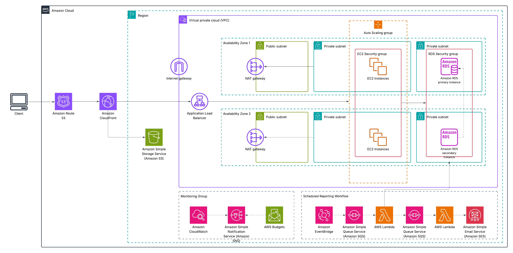

# Finch: Mock Stock Trading Platform

A full-stack, cloud-native web application that simulates stock trading using **virtual funds** while fetching **real-time stock quotes** from a public API, **IEX Cloud**. Finch allows users to register, log in, view stock data, and simulate buying/selling shares — mimicking real-world trading behavior without using real money.

---

## Table of Contents

* [Solution Overview](#solution-overview)
* [Architecture Diagram](#architecture-diagram)
* [Architecture Components](#architecture-components)

* [Collection of Operational Metrics](#collection-of-operational-metrics)
* [Acknowledgements](#acknowledgements)
* [License](#license)

---

## Solution Overview

**Finch** is inspired by real-world stock trading apps but designed for **simulation purposes**. It is a secure, scalable application that provides:

* User registration and authentication
* Real-time stock quote retrieval via a public API, **IEX Cloud**
* Simulated buy/sell operations using virtual cash
* Portfolio tracking and transaction history
* Monthly emailed reports with trading summaries and portfolio insights

The core application is built using **Flask** (a lightweight Python web framework), while infrastructure is deployed on **AWS** and follows best practices for high availability, scalability, and cost efficiency.

---

## Architecture Diagram

*Click to enlarge.*

---

## Architecture Components

Key AWS services used:

* **Amazon Route 53** and **CloudFront**: DNS and content delivery for global performance.
* **Amazon S3**: Static file hosting (HTML, CSS, JS).
* **Amazon VPC**: Network isolation with private and public subnets.
* **Amazon EC2 (in private subnets)**: Hosts the Flask application, auto-scaled and behind an Application Load Balancer.
* **Amazon RDS (PostgreSQL)**: Stores user data, transactions, and portfolio info, isolated in private subnets.
* **Amazon NAT Gateway**: Allows EC2 instances to access external stock APIs securely.

**Monitoring & Cost Management**

*   **Amazon CloudWatch**: Captures logs and custom metrics, and defines alarms for unusual activity.
*   **Amazon SNS**: Sends real-time alerts to admins based on CloudWatch alarms and budget notifications.
*   **AWS Budgets**: Tracks AWS spend and triggers cost alerts when thresholds are exceeded.
    

**Scheduled Reporting Workflow**

*   **Amazon EventBridge**: Triggers the monthly reporting workflow automatically.  
*   **Amazon SQS**: Queues reporting tasks for asynchronous processing.  
*   **AWS Lambda**: Processes portfolio data and formats email content in response to queued events.  
*   **Amazon SES**: Sends customized monthly reports to users with portfolio insights and transaction summaries.

This architecture uses a **hybrid approach** — combining EC2-based compute with **serverless components** for asynchronous workloads like scheduled email reporting.

---

## Collection of Operational Metrics

Finch uses AWS-native monitoring and alerting tools to ensure observability, high availability and cost efficiency:

* **Amazon CloudWatch** collects logs and metrics, enabling proactive detection of application issues.
* **Amazon SNS** sends immediate notifications to administrators for critical events and budget alerts.
* **AWS Budgets** monitors spend to prevent unexpected costs by triggering alerts before thresholds are reached.

These services work together to ensure operational visibility and prompt response to any anomalies.

---

## Acknowledgements

This project is based on the **CS50 Finance** problem set from [Harvard's CS50: Introduction to Computer Science](https://cs50.harvard.edu/x/). The original assignment served as the foundation for Finch's core functionality, including user authentication, stock quoting, and transaction tracking.

Special thanks to the **CS50 team** for providing high-quality, open-source educational content that inspired this project.

---

## License

This project is licensed under the MIT License. See `LICENSE` for details.

