# Finch

**A full-stack simulated trading platform built with Flask and live market data.**

Finch began as a rebuild of CS50's Finance problem set, developed alongside studying for the AWS Solutions Architect certification with containerization and cloud deployment as the end goal. What started as a scoped exercise grew into a production-minded application — rebuilt from scratch once the first version became overengineered, and refactored deliberately into a Blueprint architecture with a real trading engine, background job processing, FIFO cost-basis accounting, and a polished responsive UI.

The current version targets SQLite for simplicity. The next milestone is an ORM and PostgreSQL migration, followed by Docker containerization and deployment to AWS.

---

## Table of Contents

- [Overview](#overview)
- [Tech Stack](#tech-stack)
- [Features](#features)
- [Architecture](#architecture)
- [Database Design](#database-design)
- [Trading Engine](#trading-engine)
- [Security](#security)
- [Frontend](#frontend)
- [Roadmap](#roadmap)

---

## Overview

Every new user is allocated $10,000 in virtual capital and can trade any publicly listed stock using live market prices sourced from Yahoo Finance. The platform supports market orders that execute immediately at the current price, and limit orders that remain open until the market reaches the specified target price — evaluated every 60 seconds by a background processor.

Every purchase is recorded as a lot. When a user sells, realized P&L is calculated by consuming those lots in FIFO order — the same cost-basis accounting method used by real brokerages. Unrealized P&L on open positions is derived from the holding's weighted average cost against the current market price.

Beyond trading, Finch is a full portfolio management interface: a live dashboard with allocation charts and market movers, a watchlist with real-time price updates, a complete order and transaction history, and full account management. Every cash movement — deposit, withdrawal, trade debit and credit, limit order reserve, refund, and cancellation — is recorded in a full audit trail.

| Capability | Detail |
|---|---|
| **Market data** | Live prices via yfinance, cached at a 60-second TTL to avoid redundant API calls |
| **Order types** | Market and limit orders for both buys and sells |
| **Order execution** | Market orders execute immediately; limit orders are evaluated every 60 seconds by a background processor and execute when the market reaches the target price |
| **Cost basis & P&L** | Every purchase is recorded as a lot. Unrealized P&L is derived from the holding's weighted average cost. Realized P&L is calculated via FIFO lot consumption at the point of sale |
| **Portfolio analytics** | Total value, total P&L, today's P&L, asset allocation (equity vs. cash), sector allocation, and daily top movers |
| **Watchlist** | Track stocks without holding them; prices update live in the background |
| **Cash management** | Deposits and withdrawals with enforced daily and weekly limits |
| **Account management** | Update name, email, and password; delete account |

---

## Tech Stack

| Layer | Technology |
|---|---|
| Programming Language | Python 3.13+ |
| Web framework | Flask |
| Database | SQLite via `sqlite3` (raw SQL, no ORM) |
| Market data | yfinance |
| Background jobs | APScheduler (BackgroundScheduler) |
| Auth & sessions | Werkzeug password hashing, Flask-Session (filesystem) |
| CSRF protection | Flask-WTF |
| Rate limiting | Flask-Limiter |
| Frontend framework | Bootstrap 5 |
| JavaScript | Vanilla JS, ES modules |
| Charts | Chart.js |
| Market widgets | TradingView Embed Widgets |

---

## Features

### Dashboard

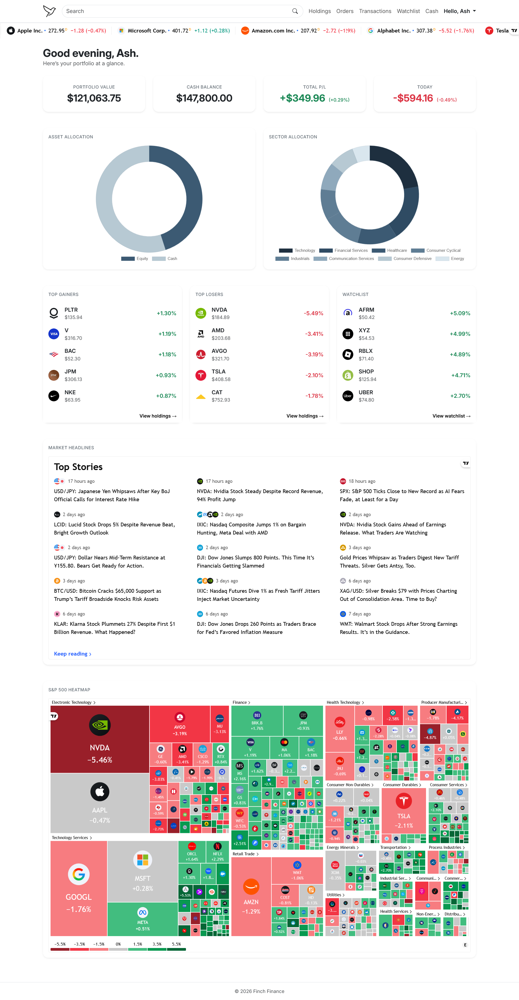

The dashboard presents a real-time portfolio overview. Four summary cards display portfolio value, cash balance, total unrealized P&L, and today's P&L. Two Chart.js donut charts visualize asset allocation (equity vs. cash) and sector allocation across holdings. Three ranked lists surface the top 5 daily gainers, top 5 daily losers from the portfolio, and top 5 movers from the watchlist. Below the portfolio section, a TradingView market news feed and S&P 500 heatmap provide broader market context.

All data is fetched from `/snapshots` on load and refreshed every 60 seconds via polling. Cards animate with a directional flash on value change. Polling is suspended via the Page Visibility API when the tab is not active and resumes on focus. Sector allocation percentages are computed using a residual method to guarantee they sum to exactly 100% regardless of floating-point rounding.

---

### Stock Page

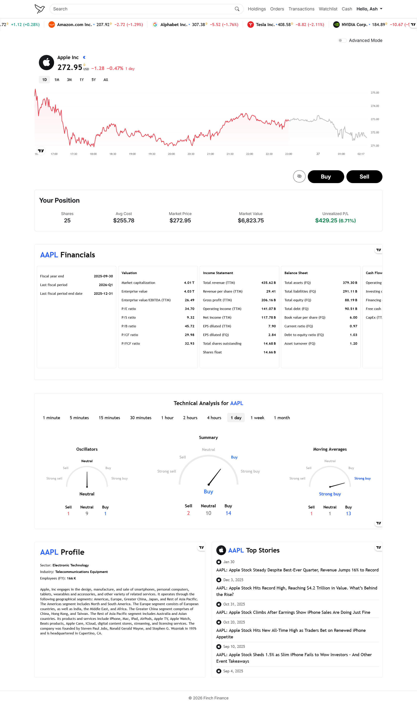

Each stock page is built around TradingView embed widgets. Simple Mode renders an area chart with key price data. Advanced Mode — toggled via a switch — renders a full candlestick chart with drawing tools, technical indicators, and multi-timeframe support. The advanced chart widget is injected dynamically on toggle rather than pre-rendered, as TradingView's embed scripts require a visible DOM element to initialize.

Below the chart: a live position card (shown only when the user holds the stock) displaying shares, weighted average cost, current market price, market value, and unrealized P&L; a TradingView fundamentals widget; a technical analysis gauge; a company profile; and a symbol-specific news feed. Unit price updates are polled every 60 seconds and dispatched as a custom DOM event, which the trade sidebar listens to in order to keep order summaries current.


#### Trade Sidebar

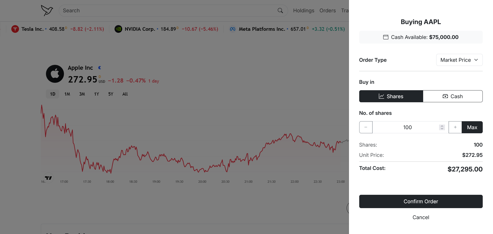
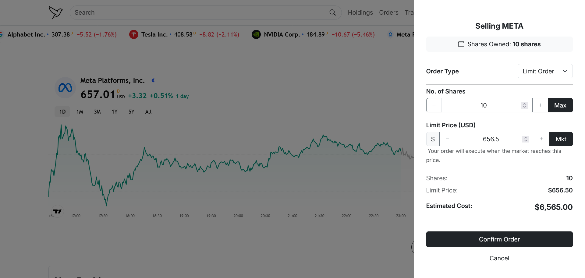

Buy and sell orders are placed via a Bootstrap offcanvas sidebar without navigating away from the stock page. The sidebar supports two order types selectable via dropdown. **Market orders** execute at the current price; buy orders additionally support a cash-input mode in which a dollar amount is converted to the maximum whole-share quantity at the current price. **Limit orders** accept a quantity and a target price, with a button to pre-fill the current market price. Order summaries — shares, unit price, estimated total — update reactively as inputs change.

The Confirm button is disabled until all inputs satisfy validation. On submission, the button is disabled immediately and relabeled "Processing…". This client-side guard is reinforced server-side by the `@prevent_double_submit` decorator, which rejects repeated submissions to the same route within a 3-second window.

---

### Holdings

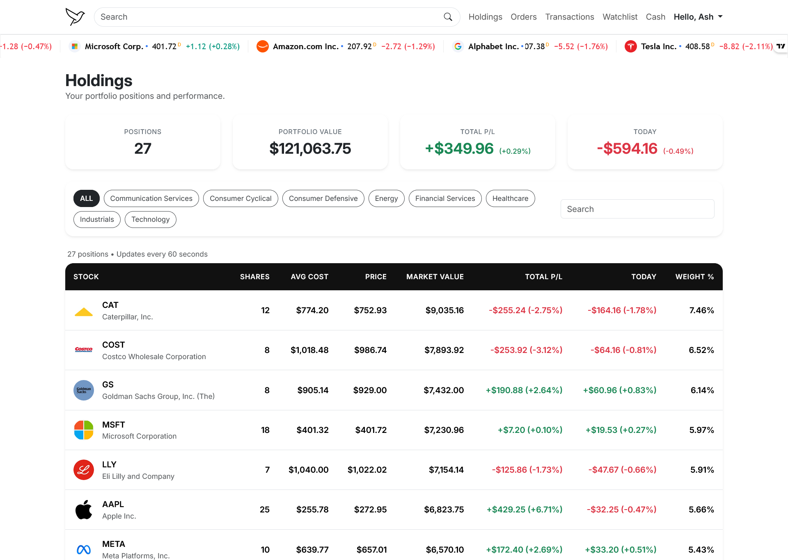

The holdings page lists all open positions. Portfolio-level totals — number of positions, aggregate market value, total unrealized P&L and today's P&L — are displayed in summary cards above the table. Each row displays the symbol, share count, weighted average cost, current market price, market value, and unrealized P&L in both dollar and percentage terms. P&L figures are color-coded.

---

### Orders

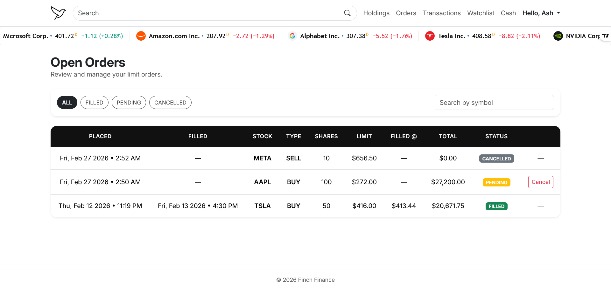

The orders page presents the full history of limit orders across all statuses: `PENDING`, `FILLED`, and `CANCELLED`. Each row shows placement time, fill time (where applicable), symbol, order type, share quantity, limit price, fill price, total, and status. Pending orders include a Cancel button that opens a confirmation modal and fires an async cancellation request on confirmation. The order row updates in place on success — no page reload required. Status filter chips and a symbol search input operate client-side on the pre-loaded dataset.

---

### Transactions

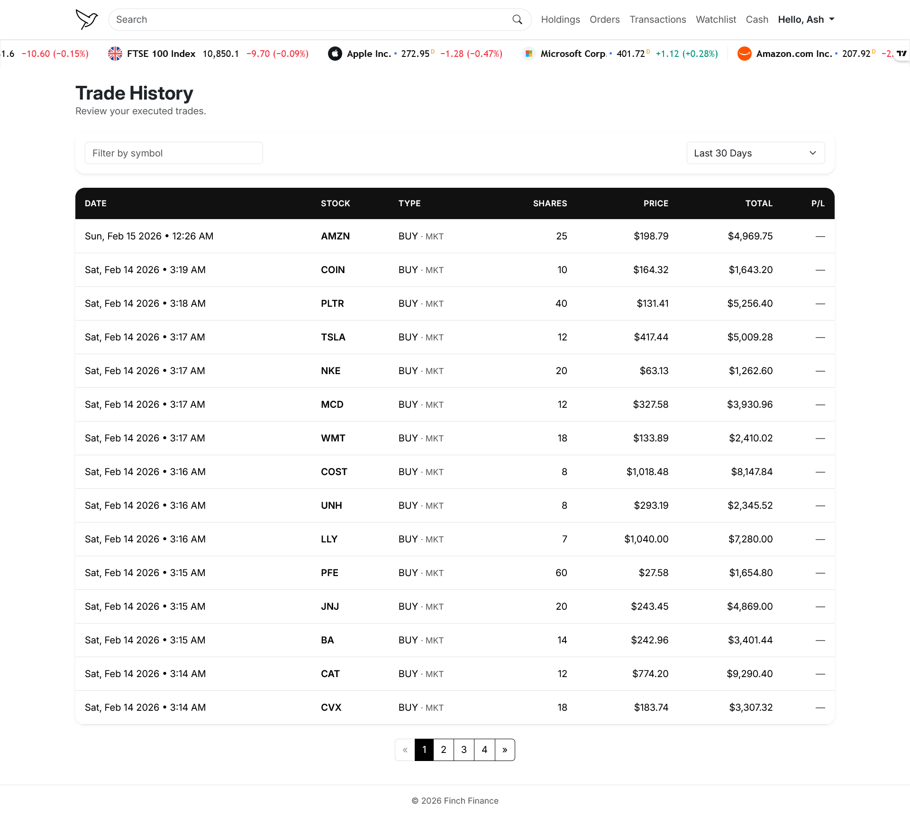

The transactions page presents the complete executed trade history, paginated at 15 rows per page. Trades are filterable by symbol prefix and by time range (30 days, 90 days, 365 days, all time). Each row displays the trade date, symbol, type (BUY/SELL), order source (MKT/LMT), share quantity, execution price, total, and realized P&L for sell trades. All filtering and pagination are client-side operations on the server-rendered dataset.

---

### Watchlist

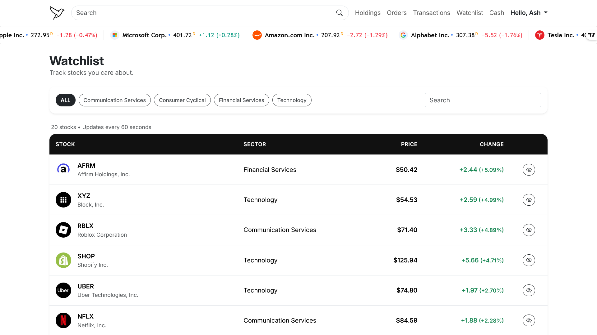

The watchlist displays tracked symbols with live price and daily change data. Prices are refreshed every 60 seconds via a dedicated `/watchlist/snapshots` endpoint. When a price changes between poll cycles, the affected row's price and change cells animate with a directional color flash. Polling is paused when the browser tab loses focus and resumes on return.

Rows are sortable by price or daily percentage change. Filter chips derived from the user's actual sector exposure allow narrowing the list by sector. Symbol search filters rows client-side without a round trip. Removing a symbol from the watchlist fires an async POST and removes the row immediately without a page reload. The same toggle is available from the stock page.

---

### Cash

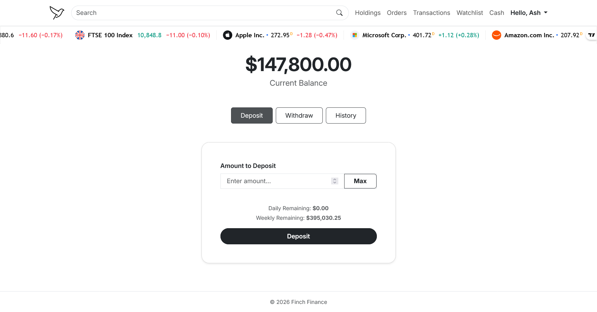
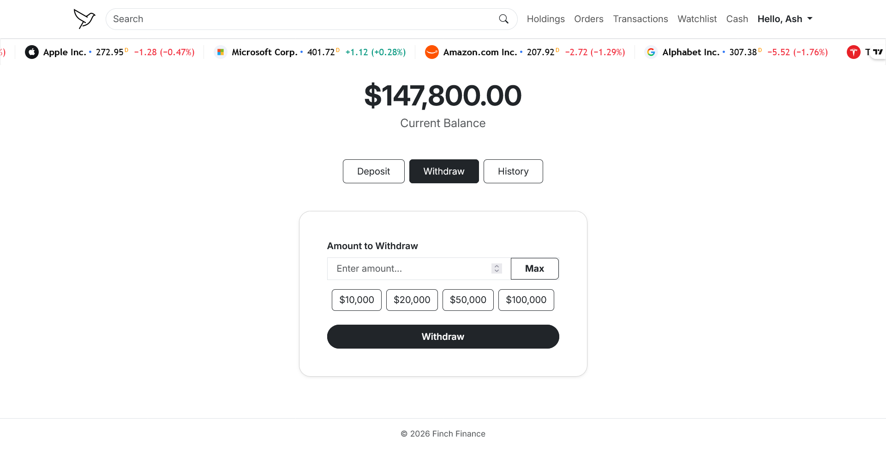
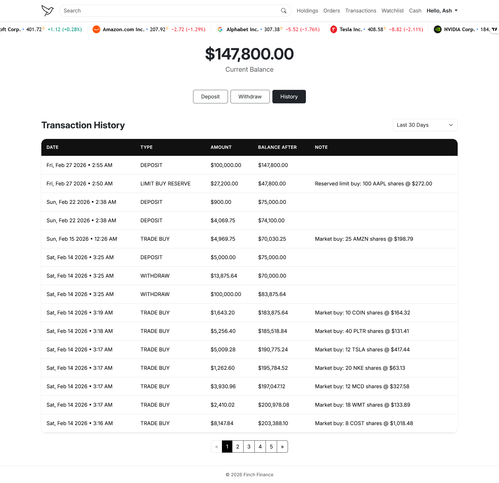

The cash page provides deposit and withdrawal functionality with server-enforced limits: $100,000 per day, $500,000 per week, and a $1,000,000,000 maximum balance. Limits are enforced within the same `BEGIN IMMEDIATE` transaction as the balance update, eliminating any race condition window. Quick-select buttons are generated dynamically at 5%, 10%, 25%, and 50% of the available limit, rounded to the nearest sensible value rather than arbitrary decimals. A transaction history tab presents the full audit log of cash movements with the same time-range filtering and pagination pattern used across the application.

---

### Account

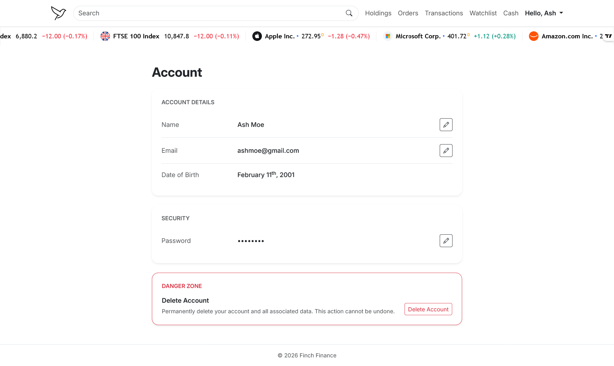

Account settings are presented as a clean profile page with inline edit controls for name, email, and password, plus an account deletion option in a clearly marked danger zone. All updates are handled via a single reusable modal component driven by a configuration map — each action (change name, change email, change password, delete account) declares its fields, API endpoint, client-side validation logic, and optimistic UI update in one place. Field-level errors returned by the API are mapped directly back to the corresponding input fields. A password change invalidates the current session and requires re-authentication.

---

### Authentication

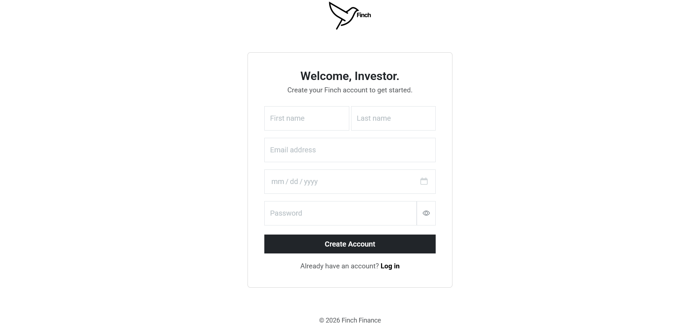
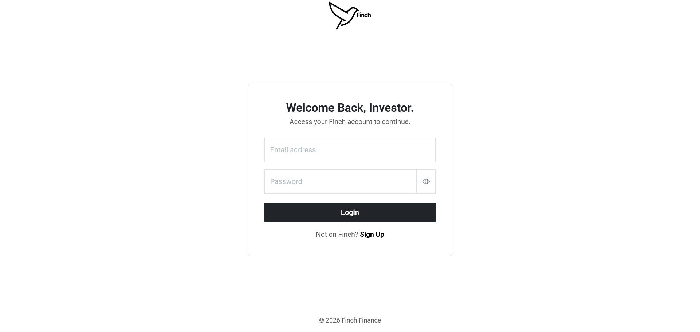

Registration collects first name, last name, date of birth (minimum age 13, enforced via `python-dateutil`), email, and password. All fields are validated on both the client and server — the same rules are implemented in both `utils/validators.py` and `auth.js`. Passwords are hashed with Werkzeug's `generate_password_hash`. Login and registration routes are rate-limited to 3 requests per minute. Auth forms correctly handle browser back/forward cache restoration via the `pageshow` event, resetting form state and clearing validation feedback when the page is served from bfcache.

---

## Architecture

Finch uses Flask's **application factory pattern**. `create_app()` in `app.py` initializes all extensions, registers blueprints, and starts the APScheduler instance. Nothing executes at import time, which keeps the application testable and containerization-ready.

The codebase is organized around a **Blueprint-per-domain** structure. Each feature domain owns its routes, service layer, and `__init__.py`. Routes are intentionally thin — they handle HTTP concerns (request parsing, flash messages, redirects) and delegate all business logic to the service layer. Service modules are Flask-agnostic: they accept typed parameters, enforce business rules, interact with the database, and either return a result or raise a typed domain exception (`TradingError`, `CashError`).

Extensions — CSRF, rate limiter, session handler, scheduler — are instantiated in `extensions.py` and bound to the application in `create_app()`, avoiding circular imports.

```
finch/
├── app.py                          Application factory, scheduler initialization
├── extensions.py                   Shared extension instances (CSRF, Session, Limiter, Scheduler)
├── finch.db                        SQLite database file
│
├── blueprints/
│   ├── trading/
│   │   ├── services.py             Order execution, FIFO accounting, price caching
│   │   ├── processor.py            Scheduled limit order processor entry point
│   │   └── routes.py               /buy/<symbol>, /sell/<symbol>
│   ├── dashboard/
│   │   ├── services.py             Portfolio summary, allocation, mover computation
│   │   └── routes.py               /, /snapshots
│   ├── holdings/
│   │   ├── services.py             Position and P&L calculations
│   │   └── routes.py               /holdings
│   ├── cash/
│   │   ├── services.py             Deposit and withdrawal with limit enforcement
│   │   └── routes.py               /cash
│   ├── account/
│   │   ├── services.py             Name, email, password, delete operations
│   │   └── routes.py               /api/account/* (JSON endpoints)
│   ├── auth/
│   │   └── routes.py               /signup, /login, /logout
│   ├── orders/
│   │   └── routes.py               /orders, /orders/<id>/cancel
│   ├── stocks/
│   │   └── routes.py               /search, /quote/<symbol>, /stock/<ticker>
│   ├── transactions/
│   │   └── routes.py               /transactions
│   └── watchlist/
│       └── routes.py               /watchlist, /watchlist/<ticker>, /watchlist/snapshots
│
├── models/
│   └── db.py                       get_db(), begin_immediate()
│
├── static/
│   ├── assets/                     Logo and icon assets (light and dark variants)
│   ├── css/
│   │   ├── styles.css              Authenticated layout styles
│   │   └── auth.css                Login and signup page styles
│   └── js/
│       ├── sidebar.js              Trade sidebar factory (market and limit orders)
│       ├── stock.js                Stock page: chart toggle, watchlist toggle, sidebar init
│       ├── dashboard.js            Live polling, Chart.js rendering, mover display
│       ├── watchlist.js            Live polling, flash animations, sort and filter
│       ├── transactions.js         Client-side filter, pagination, date formatting
│       ├── orders.js               Client-side filter, pagination, async cancellation
│       ├── cash.js                 Tab management, form validation, quick buttons, history
│       ├── account.js              Modal-driven settings, field-level API error handling
│       ├── auth.js                 Form validation, password toggle, bfcache reset
│       └── toast.js                Bootstrap toast wrapper (shared ES module)
│
├── templates/
│   ├── layout.html                 Authenticated layout: navbar, TradingView ticker tape, toasts
│   ├── public_layout.html          Unauthenticated layout: login and signup
│   ├── partials/
│   │   ├── _trade_sidebar.html     Offcanvas sidebar Jinja macro
│   │   ├── _market_order_section.html
│   │   └── _limit_order_section.html
│   └── *.html                      Page-level templates
│
└── utils/
    ├── helpers.py                  yfinance wrappers, to_decimal(), usd(), format_dob()
    ├── validators.py               Reusable validation functions, mirrored in JavaScript
    └── decorators.py               @login_required, @prevent_double_submit
```

---

## Database Design

Finch uses nine tables. The schema is designed around two principles: **atomicity** and **separation of concerns between the live position cache and the historical lot ledger.**

### `holdings` and `lots` — Two Views of One Truth

The most important design decision in the schema is keeping `holdings` and `lots` as separate tables with distinct responsibilities.

`lots` is the ledger. Every buy creates a lot recording the symbol, quantity, purchase price, and remaining quantity. Sells consume lots in FIFO order, decrementing `qty_remaining`. A `CHECK (qty_remaining >= 0)` constraint enforces integrity at the database level. This table is the source of truth for cost-basis accounting and realized P&L.

`holdings` is the cache. It stores the current share count and weighted average cost per position for fast read access. It is updated on every buy (incremental weighted average recalculation) and rebuilt from the lot ledger after every sell via `_recalc_holding_from_lots()`. When a position's last lot is fully consumed, the holding row is deleted. This approach guarantees that `holdings` is always consistent with `lots`, regardless of how many partial transactions have occurred.

Attempting to serve both roles — historical cost basis and live position summary — from a single table requires compromises on both. Keeping them separate means each table does one thing correctly.

### Table Reference

| Table | Purpose |
|---|---|
| `users` | Account credentials and live cash balance. Balance is stored denormalized on the user row for atomic read-modify-write within trade transactions. |
| `lots` | FIFO lot ledger. One row per purchase. `qty_remaining` decremented on sells. Source of truth for cost basis. |
| `holdings` | Denormalized position cache. Rebuilt from `lots` on sells. Deleted when position is closed. |
| `limit_orders` | Limit order lifecycle: `PENDING → PROCESSING → FILLED \| CANCELLED`. `PROCESSING` status functions as an optimistic lock during execution. |
| `trades` | Immutable trade ledger. One row per executed order (market or limit, buy or sell). Stores execution price, quantity, total, order source, and realized P&L for sells. |
| `stock_snapshots` | 60-second TTL price cache. Prevents redundant Yahoo Finance API calls on every page load. |
| `stocks` | 7-day TTL metadata cache. Stores name, sector, industry, and exchange per symbol. Used for watchlist joins and sector allocation. |
| `cash_transactions` | Audit log of every cash movement: deposits, withdrawals, trade debits and credits, limit buy reserves, refunds, and cancellation credits. Each row records the resulting balance after the event. |
| `watchlist` | `(user_id, symbol)` composite primary key. No additional columns required. |

---

## Trading Engine

`blueprints/trading/services.py` is the core of the application. All order execution, lot accounting, and price caching logic lives here. The module exports a clean public API — `market_buy`, `market_sell`, `place_limit_buy`, `place_limit_sell`, `cancel_limit_order`, `process_pending_limit_orders` — and keeps all internal helpers private.

### Transaction Model

Every write operation opens an explicit `BEGIN IMMEDIATE` transaction via `begin_immediate(conn)`. This acquires a write lock at transaction start rather than at the first write statement — SQLite's default deferred locking behavior. For operations that must read a balance and then update it, deferred locking creates a window where two concurrent requests could read the same value before either writes. `BEGIN IMMEDIATE` eliminates that window.

`TradingError` is raised for business rule violations (insufficient funds, insufficient shares, invalid inputs). All other exceptions are caught, logged with structured context (user ID, symbol, shares, price, exception type), and re-raised as `TradingError`. In both cases the transaction is rolled back. Routes receive a clean, typed exception — never a raw database error.

### Market Orders

**Buy:** Fetches the current market price, opens a `BEGIN IMMEDIATE` transaction, validates the cash balance, deducts the total cost, creates a lot, updates or creates the holding with a recalculated weighted average cost, and records entries in both `trades` and `cash_transactions`. All within a single atomic transaction.

**Sell:** Fetches the current market price, opens a `BEGIN IMMEDIATE` transaction, validates available shares — defined as held shares minus shares committed to open limit sell orders — consumes lots in FIFO order via `_consume_lots_fifo()`, accumulates realized P&L across consumed lots, rebuilds the holding from remaining lots via `_recalc_holding_from_lots()`, credits proceeds to the cash balance, and records entries in `trades` and `cash_transactions`.

### FIFO Lot Consumption

`_consume_lots_fifo()` retrieves all lots for the user and symbol with `qty_remaining > 0`, ordered by `created_at ASC`. It iterates the lots, consuming the lesser of `qty_remaining` and the outstanding sell quantity from each. For each share consumed, `(sell_price − lot_price)` is accumulated as realized P&L. Lot `qty_remaining` values are decremented accordingly. If the consumed quantity does not reconcile with the requested quantity, a `TradingError` is raised as a data integrity guard.

After consumption, `_recalc_holding_from_lots()` rebuilds the `holdings` row by summing all remaining lots. If no lots remain, the row is deleted.

### Limit Orders

**Placement — Buy:** Deducts `limit_price × shares` from the cash balance immediately as a reserve. Records a `LIMIT BUY RESERVE` entry in `cash_transactions`. Inserts the limit order with `status = 'PENDING'` and `reserved_total` set to the reserved amount.

**Placement — Sell:** No cash is reserved. Available shares are recalculated as `held shares − SUM(shares of pending limit sell orders for this symbol)`. The order is inserted with `status = 'PENDING'`.

**Execution — Buy:** Executes at the current market price, not the limit price. If the execution price is below the reserved amount, the difference is refunded to the cash balance with a `LIMIT BUY REFUND` entry in `cash_transactions`. Lot and holding updates follow the same path as a market buy.

**Execution — Sell:** Re-validates available lot quantity at execution time. If insufficient lots remain (e.g., the position was closed by a market sell after the limit order was placed), the order is auto-cancelled with a warning log. Otherwise, lot consumption and holding updates follow the same path as a market sell.

### The Limit Order Processor

`process_pending_limit_orders()` runs every 60 seconds via APScheduler. At the start of each run, a watchdog query resets any orders with `status = 'PROCESSING'` and no `filled_at` timestamp older than two minutes, recovering from mid-execution crashes.

For each pending order, the processor fetches the current market price and evaluates the trigger condition:

- **Limit buy:** `current_price ≤ limit_price`
- **Limit sell:** `current_price ≥ limit_price`

Execution uses an **optimistic lock**. The first statement in `_execute_limit_buy()` and `_execute_limit_sell()` is:

```sql
UPDATE limit_orders SET status = 'PROCESSING'
WHERE id = ? AND status = 'PENDING'
```

If `rowcount == 0`, the order was already claimed by another execution context and a `TradingError` is raised immediately. Each order is processed in its own `BEGIN IMMEDIATE` transaction. Failures are caught per-order, logged, and skipped — a failure on one order does not abort the batch.

### Price Caching

`get_stock_snapshot()` implements a 60-second TTL cache in `stock_snapshots`. On a cache hit within TTL, the stored record is returned without an API call. On a miss or stale record, a fresh fetch is performed, the snapshot is upserted, and the result is returned. `get_batch_snapshots()` wraps this for multiple symbols, deduplicates the input set, and silently skips any symbol that fails to fetch — a single unavailable ticker should never interrupt a watchlist or dashboard load.

Stock metadata (name, sector, industry, exchange) is cached separately in `stocks` with a 7-day TTL via `update_stock_metadata()`, which upserts on conflict.

---

## Security

| Concern | Implementation |
|---|---|
| CSRF | Flask-WTF global protection. Forms use `csrf_token()`. AJAX sends token via `X-CSRFToken` header from a `<meta>` tag in the base layout. |
| Rate limiting | Flask-Limiter. Auth: 3/min. Trading: 10/min. Cash: 5/min. Account API: 3–20/hour by endpoint sensitivity. |
| Double-submit | `@prevent_double_submit` decorator records last submission timestamp per route in session. Requests within a 3-second window are rejected server-side, independent of client-side button disabling. |
| Session security | `SESSION_COOKIE_SECURE`, `SESSION_COOKIE_HTTPONLY`, `SESSION_COOKIE_SAMESITE=Lax`. Session data stored server-side; cookie holds only an opaque ID. |
| Password hashing | Werkzeug `generate_password_hash` / `check_password_hash`. Requirements: 8+ characters, uppercase, lowercase, digit, symbol — enforced on both client and server. |
| SQL injection | Parameterized queries exclusively. No string interpolation in SQL throughout the codebase. |
| Concurrency | `BEGIN IMMEDIATE` transactions on all write operations. Optimistic locking on limit order execution via status field CAS update. |
| Input validation | All fields validated server-side in Python. Client-side JavaScript mirrors the same rules for immediate feedback. Server validation is always authoritative. |

---

## Frontend

The frontend is written in vanilla JavaScript with no build toolchain, no bundler, and no framework dependencies. ES modules are used for shared utilities — `toast.js` is imported by `stock.js`, `cash.js`, and `account.js`. All other scripts are page-scoped and loaded per template.

Server-rendered data is passed to JavaScript via `window.*` globals serialized as JSON in inline `<script>` blocks. This pattern is used consistently across data-heavy pages (transactions, orders, watchlist, cash history): the full dataset is embedded on first load, and all filtering, sorting, and pagination operate client-side without additional requests. Flask flash messages are passed via `window.FLASH_MESSAGES` and rendered as Bootstrap toasts on page load.

SQLite stores timestamps as UTC strings without timezone indicators. JavaScript's `Date` constructor interprets bare datetime strings inconsistently across browsers. All date parsing in Finch explicitly splits the timestamp string and constructs a `Date` object via `Date.UTC()`, ensuring consistent timezone-correct rendering regardless of browser or locale.

Live-update pages (dashboard, holdings, watchlist) implement the Page Visibility API to suspend polling when the tab is not active and resume when focus returns, avoiding unnecessary API calls.

---

## Roadmap

| Milestone | Description |
|---|---|
| Dark mode | Full dark theme with user preference persistence. |
| ORM + PostgreSQL | Migrate from raw SQLite to SQLAlchemy with a PostgreSQL backend. The service layer is already cleanly separated from database calls, making the migration surface well-defined. |
| Flask-Login | Replace the current manual session handling with Flask-Login. |
| Email verification | Verify user email addresses on registration via a confirmation link before granting full account access. |
| Password reset | Self-service password reset via email for users who cannot log in. |
| Docker | Containerize the application for consistent local and cloud environments. |
| AWS deployment | EC2 (application), RDS PostgreSQL (database), Application Load Balancer (HTTPS termination), S3 + CloudFront (static assets). |

---

## Development Notes

Finch was developed with AI assistance. Architecture decisions, trading engine design, schema modeling, and security implementation were deliberate and made with full understanding of the tradeoffs involved. The project was rebuilt from scratch after an initial overengineered version — the second pass prioritized correctness, clarity, and a clean separation of concerns over feature velocity.

---

*Finch is not affiliated with any financial institution. All trading is simulated. No real money is involved.*
